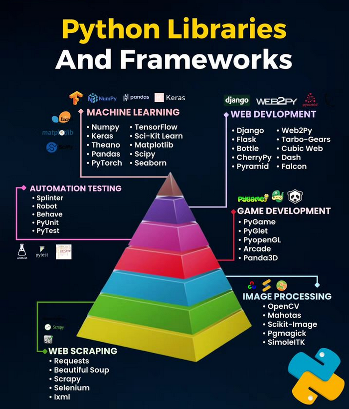

PCEP™ – Certified Entry-Level Python Programmer

---

???+ abstract "PCEP"

    The exam consists of four sections:

    | Section                 | Description                     |
    | ----------------------- | ------------------------------- |
    | `section 1 -> 7 items`  | Max Raw Score: 180 (`18%`)      |
    | `section 2 -> 8 items`  | Max Raw Score: 290 (`29%`)      |
    | `section 3 -> 7 items`  | Max Raw Score: 250 (`25%`)      |
    | `section 4 -> 8 items`  | Max Raw Score: 280 (`28%`)      |

???+ abstract

    Section 3: Data Collections – Tuples, Dictionaries, Lists, and Strings (`25%`)

    Objectives covered by the block (7 exam items)

    PCEP-30-02 3.1 – Collect and process data using lists

    - constructing vectors
    - indexing and slicing
    - the len() function
    - list methods: `append()`, `insert()`, `index()`, etc.
    - functions: `len()`, `sorted()`
    - the `del` instruction
    - iterating through lists with the for loop
    - initializing loops
    - the `in` and `not` in operators
    - list comprehensions
    - copying and cloning
    - lists in lists: matrices and cubes

---

## Reference

- [python certification: pcep](https://pythoninstitute.org)
