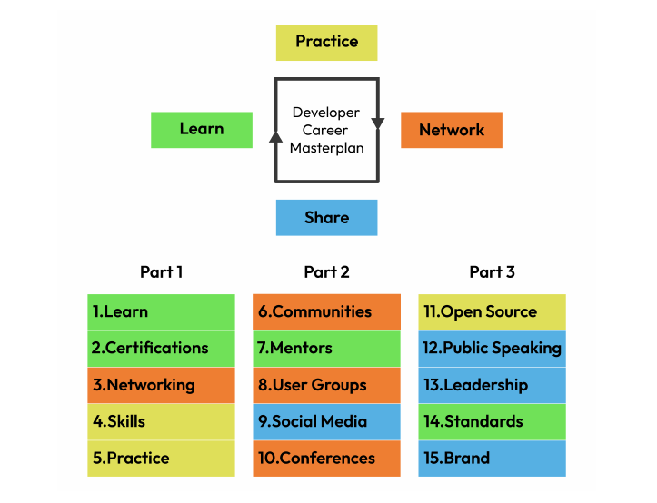

!!! success "The Secret to Learning about Technology Quickly and Continuously"

!!! info "main topic"

    - Knowledge ***versus*** skills
    - Finding focus and priorities
    - Applying ==just-in-time learning==
    - ==Practicing deliberately== to learn a tech
    - Implementing important good habits

## Knowledge **_versus_** skills

??? info

    When you learn a new skill, think about how you will apply that skill. Actively search for a way to incorporate your new skill into your day-to-day coding projects. Using the skills you gain right away will help you to build the muscle memory for the new skill and assimilate it into your library of knowledge.

    Have you ever spent hours learning something that you are not using in a project right now, and a few months later, when you need it, you remember next to nothing, and have to refresh it? And does that refreshing feel like almost having to relearn everything? There is a reason for that feeling and it is the difference between knowledge and skills.

    An effective way to think about knowledge is that it is a collection of memories that are disconnected from each other. Because they are disconnected, it takes some time for you to remember those things when you need them. And once you recover one memory, it does not help you recover other memories. This is like learning about the history of bicycles and how they were invented. Although you may love bikes, it is hard to remember the names and dates and who did what. There is a better way.

    Have you ever heard the popular saying that goes like this: **once you learn how to ride a bicycle, you never forget?** This is because riding a bicycle is not knowledge; it’s a skill. An effective way to think about skills is that they are collections of memories that are connected to each other. Once you recover one of those memories, they all come together and are accessed in a much faster way by your brain.

    That is why, once you acquire the skill, you just sit on the bicycle and go. You do not need to remember each fact about riding a bike. It just comes to you, without effort. The most important thing about skills for you to keep in mind is that although you can acquire knowledge by reading or listening, you can only develop skills by doing. There is no amount of reading, listening, watching videos, or following amazing tutorials that will ever get you to ride a bicycle. The only way is to go down to the park and try, fall, try again, and eventually, do it.

    This is the same for every developer skill that you want to master. **To really learn something, you must do things, instead of simply studying to acquire the knowledge.**

    When you write your CV or resume or prepare your LinkedIn profile, do you list in it all the books you read and YouTube videos you watched? Do you list all the knowledge you have? Or do you put more focus on the projects you worked on and the experiences you acquired?

    Even when just starting, you will clearly be better off including everything you did, even if they were just personal and volunteer projects, **because, at the end of the day, it is your experience and skills that really matter.**

---

---

## Reference

- [Developer Career Masterplan by Heather VanCura, Bruno Souza - packt]()
