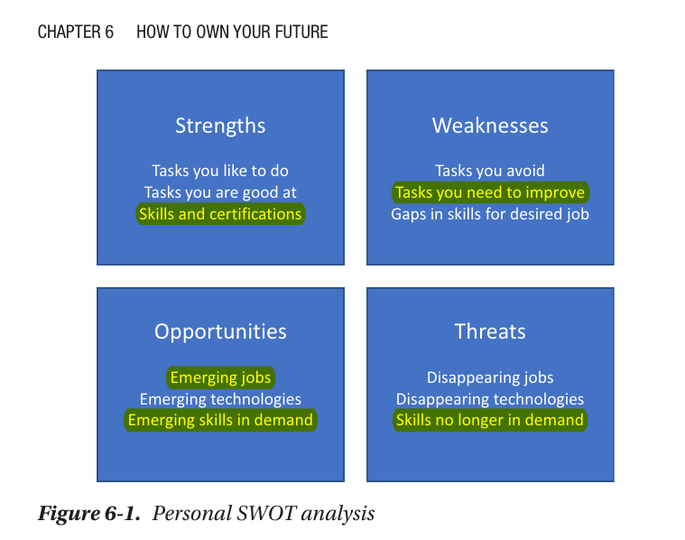

# Study technique

1. Spaced Repetition
   Spaced repetition, sometimes called `spaced practice`, `interleaved practice`, or `spaced retrieval`, is a study method that involves separating your study sessions into spaced intervals.

One of the most popular examples of spaced repetition algorithms is `Anki`, based on another popular algorithm, `SuperMemo`.

{type=application/pdf}

## space-repetition

---

---

## Reference

- [The 7 Best Study Methods for All Types of Students](https://e-student.org/best-study-methods/)
