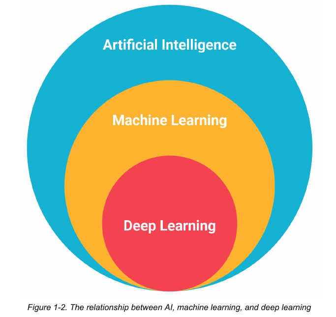

## The relation between AI, ML, and DL

---

## Types of AI

There are actually several ==types== of AI. The popular ones are the following:

1. Fuzzy systems
2. Expert systems
3. ML systems

## Factors responsible for AI propulsion

The major factors that are driving the AI force are the following:

- Data
- Algorithmic advancements
- Computer hardware advancements
- The democratization of high-performance computing

## ML – the most popular form of AI

## Types of ML

- Supervised learning
- Unsupervised learning
- Reinforcement learning
- Semi-supervised learning